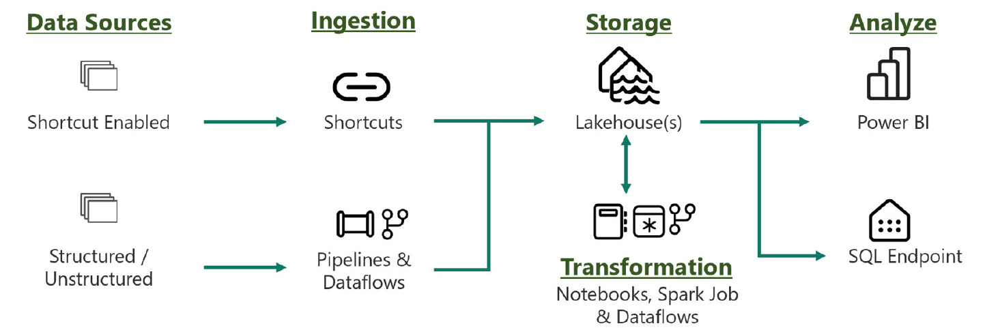
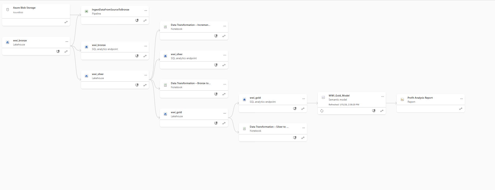

# Microsoft Fabric End-to-End Lakehouse Project

This repository contains a hands-on implementation of an end-to-end analytics system built using **Microsoft Fabric**.

## Project Overview
- Lakehouse architecture using Medallion (Bronze, Silver, Gold)
- Data ingestion using Fabric Pipelines
- Data transformation with Spark notebooks
- Delta Lake tables with historical and incremental loads
- Business aggregates in the Gold layer
- Power BI reporting using Direct Lake

## Technologies
- Microsoft Fabric
- Lakehouse & Delta Lake
- PySpark / Spark SQL
- Power BI (Direct Lake)

## Notes
This project is for learning and demonstration purposes.
## Architecture & Data Lineage

### End-to-End Architecture

### Data Lineage

